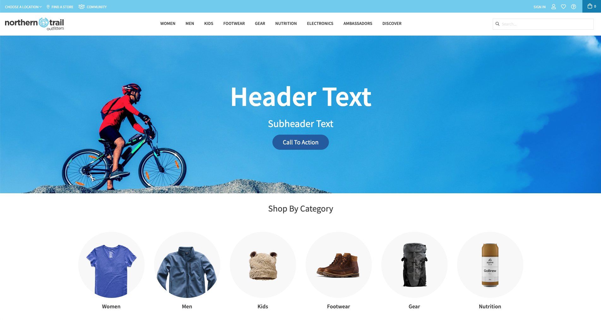
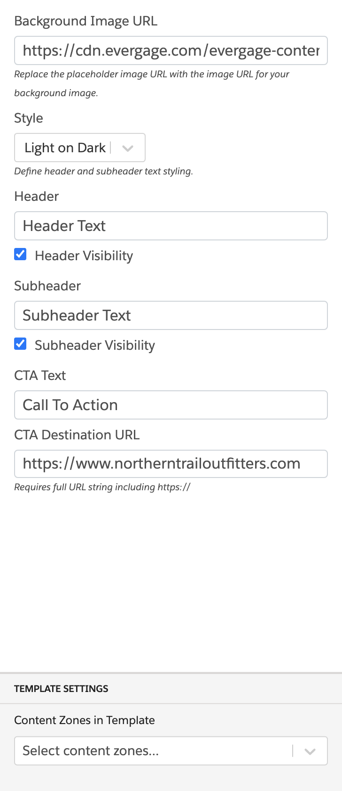

### Banner With Call-To-Action

This global template replaces a banner with a new banner containing a background image and a call-to-action button.

#### Configuration:

1. Background Image URL
2. Style (Light on dark, Dark on light)
3. Header
4. Header Visibility (enable or disable)
5. Subheader
6. Subheader Visibility (enable or disable)
7. CTA Text
8. CTA Destination URL
9. Content Zone