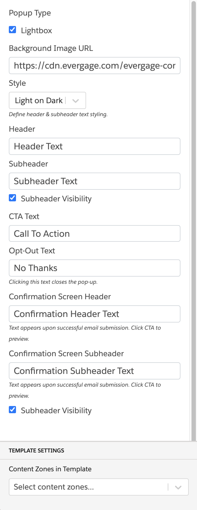

### Exit Intent Pop-Up with Email Capture

This global template displays a popup with an email capture when a user intends to exit the page.

#### Configuration:

1. Pop-Up Type
   - Lightbox (enable or disable)
2. Background Image URL
3. Style (Light on dark, Dark on light)
4. Header
5. Subheader
6. Subheader Visibility (enable or disable)
7. CTA Text
8. Opt-Out Text
9.  Confirmation Screen Header
10. Confirmation Screen Subheader
11. Subheader Visibility (enable or disable)
12. Content Zone