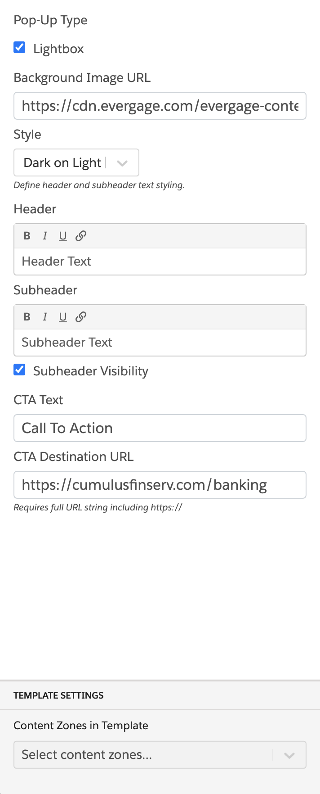

### Exit Intent Popup

This global template displays a popup when a user intends to exit the page.

#### Configuration:

1. Pop-Up Type
   - Lightbox (enable or disable)
2. Background Image URL
3. Style (Light on dark, Dark on light)
4. Header
5. Subheader
6. Subheader Visibility (enable or disable)
7. CTA Text
8. CTA Destination URL
10. Content Zone