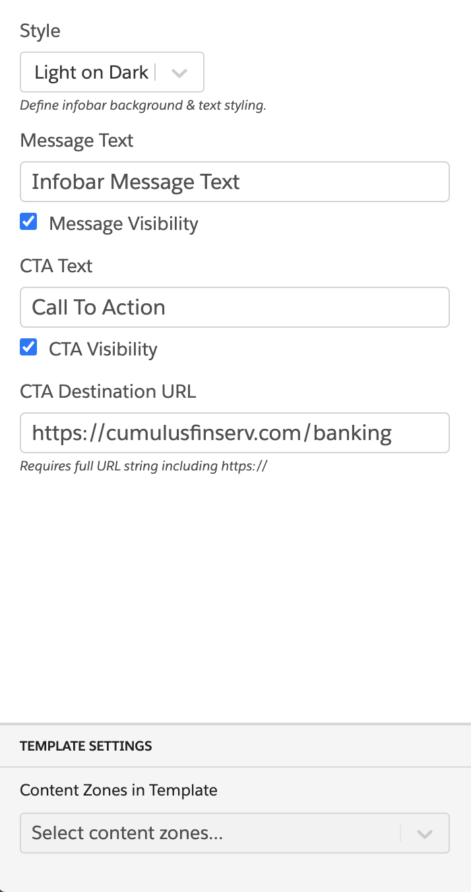

### Infobar With Call-To-Action

This global template places an infobar containing text and a call-to-action button.

### Configuration:

1. Style (Light on Dark, Dark on Light)
2. Message Text
3. Message Visibility (enable or disable)
4. CTA Text
5. CTA Visibility (enable or disable)
6. CTA Destination URL
7. Content Zone