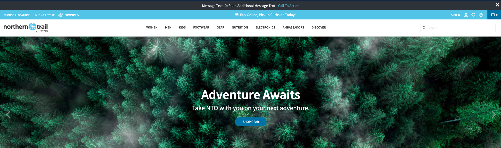
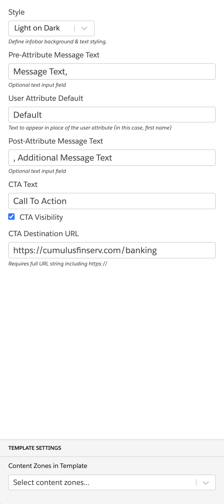

### Infobar with User Attribute and Call-To-Action

This global template places an infobar containing text, which includes a user attribute, and a call-to-action button.

### Configuration:

1. Style (Light on Dark, Dark on Light)
2. Pre-Attribute Message Text
3. User Attribute Default
4. Post-Attribute Message Text
5. CTA Text
6. CTA Visibility (enable or disable)
7. CTA Destination URL
8. Content Zone
