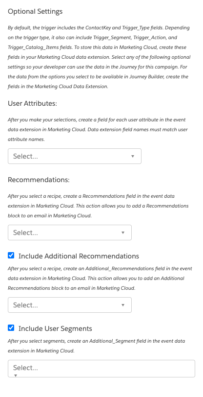

### Journey Builder Trigger

When used in a Trigger Campaign, this global template returns a Trigger_Type field. Depending on the trigger type, it could also include Trigger_Segment, Trigger_Action, and Trigger_Catalog_Items fields along with other information chosen by the Campaign Developer.

#### Configuration:

1. User Attributes
2. Recommendations
3. Include Additional Recommendations
4. Include User Segments