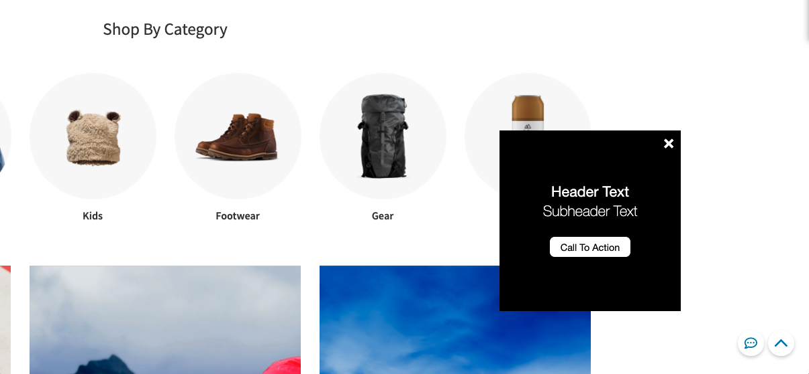
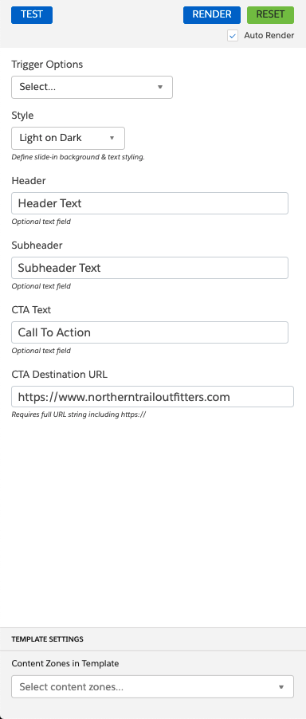

### Slide-In with Call-to-Action

This global template creates a message that slides in from the bottom-right corner of the screen, and contains a
call-to-action button.

### Configuration:

1. Trigger Options
    - Time on Page (Delay)
    - Scroll Depth
    - Inactivity
2. Style (Light on Dark, Dark on Light)
3. Header
4. Subheader
5. CTA Text
6. CTA Destination URL
7. Content Zone
